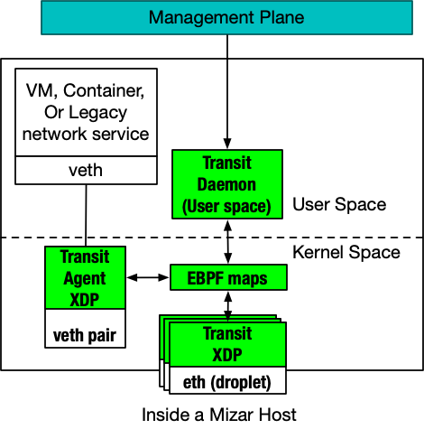

Mizar's data-plane is the core engine behind its scalability, performance, and programability. The data-plane is primarily a group of XDP programs. Before diving deep into how the data-plane is designed, we need to introduce some terminology:

* **Droplet**: a physical interface on a host with an IP to the substrate network. In the typical case where a host has a single interface, a droplet represents the host.
* **Transit Agent**: an XDP/ebpf program that processes an endpoint egress traffic.
* **Transit XDP**: the main XDP program that processess **all** ingress traffic to a droplet. The transit XDP program is extensible to support several data-plane functions including interacting with user-space networking programs.
* **Transit Daemon** A user space program that interfaces with the management plane. The daemon primarily passes configuration to the Transit XDP and Transit Agent by updating ebpf maps. It provides RPC services to the management plane to pass these configuration. Additionally the daemon provide services including: controlling kernel networking through netlink interface, programming other components on the host as needed (e.g. OpenVSwitch). Please refer to the [management plane design](management_plane.md) for details on the Transit Daemon functionalities.

The following diagram illustrates the architecture of a Mizar host (droplet(s)):

## Data-plane Functions

Mizar facilitates the development of **Multi-tenant** networking functions at various levels of the stack!

A network function is primarily an endpoint with the “bypass decapsulation” flag set to allow the back-plane pipeline to deliver the tunnel packets as is so the function has designated access to tunnel metadata as well as the inner packet. Most of the network functions will be scaled.

Network functions shall be primarily implemented as another XDP programs (or user space programs) running on the ingress of an endpoint (e.g. L7 Load-balancers). This is required to provide the needed processing isolation of network functions from the main packet processing pipeline and allow such functions to scale independently of transit switches and routers.

Other functions may be developed as a packet processing step in the back-plane packet processing pipeline of the NIC ingress. The design choice to develop a function in-network or as a separate XDP program on the endpoint, is mainly influenced by the processing the criticality of the function. The general guiding design principle in this regard is:

“An in-network function shall add a negligible processing overhead to the main packet processing pipeline, and must be absolutely critical to developing in the backplane pipeline.”

Examples of these functions are Cross-VPC routing, VPC to the substrate router, endpoint metadata injection/stripping, network ACLs.

This backplane design allows network functions to access the inner as well as the outer packet headers and process the packets at the line-speed. The following are a non-exhaustive list of network functions that can be developed on top of Mizar backplane:

* **Security**
   - Network Groups Policy Enforcement Points
   - DDoS Mitigation

* **Load Balancing**
   - L4 Load-balancer
   - L7 Load-balancer

* **Connectivity**
   - VPN
   - Nat
   - Cross-VPC routing

* **Traffic Shaping Control**
   - QoS
   - Rate limiting
